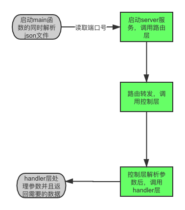

##  1.整体框架

项目的实现思路	

1.解析.ini配置文件，返回需要的端口号

2.将config.army.model.json文件转为map，在筛选出需要的士兵的id，战斗力，名字，稀有度，Cvc,解锁等级生成新的json文件

3.编写五个查询函数

4.使用gin框架，通过http的post请求获取参数从而调用上述的五个函数获取需要的内容

## 2.项目目录

```
.
├── __pycache__
│   └── locustfile.cpython-39.pyc
├── app
│   ├── app
│   ├── http2
│   │   └── httpServer.go
│   └── main.go
├── conf
│   ├── app.ini
│   ├── config.army.model.json
│   └── new.json
├── go.mod
├── go.sum
├── internal
│   ├── ctrl
│   │   └── soldier.go
│   ├── findSoldier_test.go
│   ├── globalError.go
│   ├── handler
│   │   └── findSoldier.go
│   └── router
│       └── router.go
├── locustfile.py
├── model
│   └── model.go
├── readme.md
├── util
│   ├── iniAnaly.go
│   └── jsonAnaly.go
├── 压力测试报告.html
└── 题1流程图.png
```

## 3.代码逻辑分层

| 层          | 文件夹                                    | 主要职责                      | 调用关系                  | 其他说明     |
| ----------- | ----------------------------------------- | ----------------------------- | ------------------------- | ------------ |
| 应用层      | /app/http2/httpServer.go                  | 服务器启动                    | 调用工具层，调用路由层    | 不可同层调用 |
| 工具层      | /config/iniAnaly.go ,/config/jsonAnaly.go | 解析ini文件，处理原始json文件 | 被应用层调用              | 不可同层调用 |
| 压力测试    | locustfile.py                             | 压力测试                      | 无调用关系                | 不可同层调用 |
| 单元测试    | /internal/findSoldier_test.go             | 单元测试                      | 无调用关系                | 不可同层调用 |
| 路由层      | /internal/router/router.go                | 路由转发                      | 被应用层调用，调用控制层  | 不可同层调用 |
| 控制层      | /internal/ctrl/soldier.go                 | 请求参数处理，响应            | 被路由层调用，调用handler | 不可同层调用 |
| handler层   | /internal/handler/findSoldier.go          | 处理具体业务                  | 被控制层调用              | 不可同层调用 |
| globalError | /internal/globalError                     | 统一异常处理                  | 被ctrl层调用              | 不可同层调用 |


## 4.存储设计

解析json文件：先将json文件转为map类型，其中key为id，string类型，value为储存士兵信息的结构体，再将map解析为json文件

获取每个阶段的士兵信息：类型为map类型的json，key为阶段，string类型，value为储存士兵信息的结构体

另外两个获取士兵信息：类型为map类型的json，key为id，string类型，value为储存士兵信息的结构体

## 5.接口设计

请求方法：http get

请求路径

| 接口地址                                  | 请求参数                 | 接口说明                              |
| ----------------------------------------- | ------------------------ | ------------------------------------- |
| http://localhost:8000/FindSoldierByRaUnCv | Rarity，UnlockArena，Cvc | 根据稀有度，解锁阶段，cvc获取士兵信息 |
| http://localhost:8000/FindSoldierRaById   | Id                       | 获取稀有度                            |
| http://localhost:8000/FindSoldierCoById   | Id                       | 获取战力                              |
| http://localhost:8000/FindSoldierByCv     | Cvc                      | 获取符合cvc的士兵信息                 |
| http://localhost:8000/FindSoldierByUn     | 无                       | 获取每个阶段的士兵信息                |

响应状态码

| 状态码 | 说明             |
| ------ | ---------------- |
| 无     | 成功             |
| 1001   | 参数为空         |
| 1002   | 服务内部出现异常 |


## 6.第三方库

```
"github.com/Unknwon/goconfig"
"github.com/spf13/pflag"
```

## 7.如何编译执行

cd app

go build

编译为可执行文件

./app --path1=../conf/config.army.model.json ,  --path2=../conf/new.json

运行可执行文件并在命令行输入json文件地址

go test

单元测试

locust 

压力测试

## 8.todo

将项目进一步划分，方便拓展



